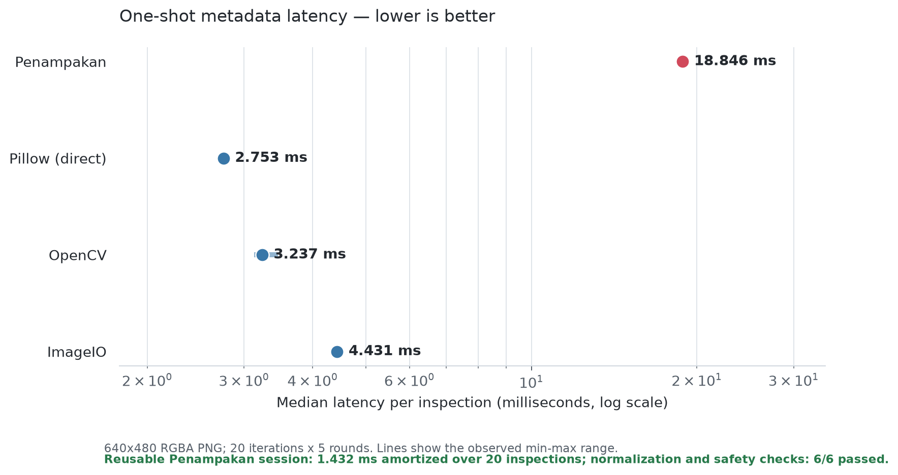

# Penampakan

Penampakan is an async-first Python library that lets a text-only language
model reason about static images. It turns results from replaceable vision
backends into typed, attributable observations, then runs a bounded tool loop
that requires the model to cite those observations in its answer.

The package can also be used without a language model for deterministic image
inspection. Its built-in Pillow backend provides normalized metadata and
dominant colors; optional adapters add Tesseract OCR and local Transformers
captioning or detection.

Penampakan is currently alpha software.

## Why Penampakan?

- Provider-neutral protocols for text LLMs and vision backends.
- Async clients and sessions, plus a blocking facade for synchronous programs.
- Immutable Pydantic contracts for assets, observations, evidence, and traces.
- Bounded tool, backend, LLM, image, and timeout budgets.
- Safe raster normalization with provenance for derived images.
- Evidence-grounded answers and redacted tracing by default.
- No generated Python or shell execution.

## Installation

Penampakan requires Python 3.10 through 3.13.

```bash
python -m pip install penampakan
```

Optional integrations are installed separately:

```bash
python -m pip install 'penampakan[ocr]'
python -m pip install 'penampakan[transformers]'
python -m pip install 'penampakan[openai]'
python -m pip install 'penampakan[anthropic]'
python -m pip install 'penampakan[litellm]'
python -m pip install 'penampakan[providers]'
```

The OCR extra installs the Python adapter; the Tesseract executable must also
be available on the system.

Provider packages stay optional. Every adapter class imports on a base install,
so `from penampakan.llms import OpenAITextLLM` always succeeds; only
constructing an adapter without its extra raises
`ConfigurationError(code="missing_optional_dependency")`.

## Quick start

Inspect an image without configuring an LLM:

```python
from penampakan import (
    ColorsRequest,
    InspectionOperation,
    InspectionPlan,
    MetadataRequest,
    Penampakan,
)

plan = InspectionPlan(
    operations=(
        InspectionOperation(request=MetadataRequest()),
        InspectionOperation(request=ColorsRequest(count=5)),
    ),
    include_available_overview=False,
)

with Penampakan() as vision:
    result = vision.inspect("photo.png", plan)

for observation in result.observations:
    print(observation.payload)
```

For evidence-grounded question answering, construct `AsyncPenampakan` or
`Penampakan` with a `TextLLM` implementation and the vision backends needed for
the task, then call `ask(image, question)`. `CallableTextLLM` and
`CallableVisionBackend` are available as adapters for application functions.

### Provider adapters

`OpenAITextLLM`, `AnthropicTextLLM`, and `LiteLLMTextLLM` compile the library's
action schema into a named, versioned provider subset, enforce one total request
deadline across retries, and report refusal, truncation, retry exhaustion, and
schema degradation as distinct redacted outcomes.

A caller-owned adapter stays open when the client closes, so nest the context
managers:

```python
import asyncio

from penampakan import AsyncPenampakan
from penampakan.llms import AnthropicTextLLM


async def main() -> None:
    async with AnthropicTextLLM(model="claude-opus-5") as llm:
        async with AsyncPenampakan(llm=llm) as vision:
            answer = await vision.ask("receipt.png", "What is the total?")
            print(answer.answer)


asyncio.run(main())
```

Hand ownership to the client instead when it should close the adapter for you:

```python
async with AsyncPenampakan(llm=AnthropicTextLLM(model="claude-opus-5"), owns_llm=True) as vision:
    answer = await vision.ask("receipt.png", "What is the total?")
```

`owns_policy` does the same for a caller-supplied `ActionPolicy`. Both default to
caller-owned, and no shared adapter or external SDK client is ever closed
implicitly.

An adapter that constructs its own SDK client disables that client's native
retries so provider attempts cannot multiply. When you inject a client and also
configure `RetryPolicy`, disable its native retries yourself
(`max_retries=0`).

A requested parameter the selected model does not support fails configuration
instead of disappearing. OpenAI reasoning-family models reject `temperature`, so
target them with the model's own sampling default rather than the library's
deterministic one:

```python
from penampakan import AsyncPenampakan
from penampakan.llms import OpenAITextLLM
from penampakan.reasoning.policy import JsonActionPolicy

policy = JsonActionPolicy(OpenAITextLLM(model="gpt-5"), temperature=1.0, owns_llm=True)
client = AsyncPenampakan(policy=policy, owns_policy=True)
```

Retry counts and token usage from every provider call appear in the run trace, so
a retried call is visible in budgets and cost reports even though it consumes one
orchestrator language-model reservation.

`LiteLLMTextLLM` requires an explicit opt-in before it will degrade:

```python
from penampakan.llms import LiteLLMTextLLM

# Raises ConfigurationError(code="strict_schema_unavailable") when the model
# cannot enforce a schema.
strict = LiteLLMTextLLM(model="gpt-4o")

# Explicitly accepts JSON-only enforcement. Every run then carries exactly one
# WarningInfo(code="degraded_schema_enforcement"), and responses report
# schema_enforcement=SchemaEnforcement.JSON_ONLY.
degraded = LiteLLMTextLLM(model="some/older-model", allow_json_only=True)
```

Input images may be PNG, JPEG, or WebP paths, encoded bytes, binary streams, or
Pillow images. Remote URLs are rejected by default. Images are orientation
corrected, bounded by configurable limits, and normalized to canonical RGB or
RGBA assets before a backend sees them.

## Benchmark

The benchmark is at
[`benchmarks/benchmark_metadata.py`](benchmarks/benchmark_metadata.py). It
compares the latency of an end-to-end Penampakan metadata inspection with
direct metadata decoding through Pillow, OpenCV, and ImageIO. The fixture is
generated locally, competitors are run in rotating order over multiple rounds,
and unavailable optional libraries are clearly reported as skipped. It also
measures Penampakan's reusable-session workflow and executes representative
normalization, safety, and attribution checks so the additional work in the
end-to-end path remains visible.

Install the benchmark dependencies and run it from the repository root:

```bash
python -m pip install -e '.[benchmark]'
python benchmarks/benchmark_metadata.py
```

Use `--help` to change the image size, warmups, iterations, rounds, or output
format. For example:

```bash
python benchmarks/benchmark_metadata.py --iterations 50 --rounds 7
python benchmarks/benchmark_metadata.py --reuse-count 50
python benchmarks/benchmark_metadata.py --format json
python benchmarks/benchmark_metadata.py --plot benchmarks/metadata_latency.png
```

Reference results captured on 10 August 2026 with Python 3.13.15 on x86-64
WSL2 (Linux 6.18.33.2, glibc 2.43) are shown below. The run used the default
640x480 RGBA PNG fixture (45,019 encoded bytes), 3 warmups, 20 iterations, and
5 rounds. The primary table is the one-shot end-to-end comparison.



| Library | Version | Median (ms) | Min (ms) | Max (ms) | Calls/s | vs fastest |
| --- | --- | ---: | ---: | ---: | ---: | ---: |
| Penampakan | 0.1.0 | 18.846 | 18.781 | 19.030 | 53.1 | 6.85x |
| Pillow (direct) | 12.3.0 | 2.753 | 2.737 | 2.806 | 363.2 | 1.00x |
| OpenCV | 5.0.0 | 3.237 | 3.129 | 3.461 | 309.0 | 1.18x |
| ImageIO | 2.37.4 | 4.431 | 4.347 | 4.470 | 225.7 | 1.61x |

The reusable workflow opens and normalizes one image, performs 20 typed
metadata inspections, and then closes the session. Its median open latency was
18.114 ms, each warm inspection was 0.494 ms, and close latency was 0.096 ms.
Including the open and close costs, that is **1.432 ms per inspection
amortized**, 13.16x faster than Penampakan's one-shot path. This is a
Penampakan lifecycle measurement, not a ranking against the direct-library
cases above.

The same run passed six executed contract checks:

- equivalent normalized metadata across PNG, JPEG, and WebP;
- EXIF orientation before reported dimensions;
- removal of opaque alpha while preserving real transparency;
- documented rejection of malformed and animated inputs;
- remote-source policy and input-byte bounds; and
- authoritative backend provenance with a completed redacted trace.

This is an overhead benchmark, not a capability or accuracy ranking. The
Penampakan path performs bounded input handling, orientation and mode
normalization, canonical encoding and hashing, typed result validation,
routing, tracing, and session cleanup. The direct alternatives only decode the
fixture and return equivalent dimensions and alpha metadata. Contract checks
are reported separately from latency rankings. Compare results on the same
machine and treat very short runs as smoke tests rather than stable
measurements.

## Development

```bash
python -m pip install -e '.[dev]'
ruff check .
ruff format --check .
mypy --strict src/penampakan
pytest -m 'not models and not ocr'
```

The default pull-request suite is fast and excludes provider, OCR, and model
integration tests:

```bash
pytest -m 'not models and not ocr and not providers'
```

The reproducible real-dependency suite uses the pinned environment in
[`integration/environment.toml`](integration/environment.toml):

```bash
docker build -f docker/integration.Dockerfile -t penampakan-integration .
mkdir -p .cache/huggingface
docker run --rm \
  -v "$PWD/.cache/huggingface:/cache/huggingface" \
  -e HF_HOME=/cache/huggingface \
  penampakan-integration python integration/prepare_models.py
docker run --rm \
  -v "$PWD:/workspace" \
  -v "$PWD/.cache/huggingface:/cache/huggingface" \
  -e HF_HOME=/cache/huggingface \
  -e HF_HUB_OFFLINE=1 \
  -e TRANSFORMERS_OFFLINE=1 \
  -e PENAMPAKAN_REQUIRE_INTEGRATION=ocr,geometry,caption,detection,e2e \
  penampakan-integration pytest -m integration tests/integration
```

Missing local binaries or model snapshots produce actionable skips when the
guard is absent. Setting `PENAMPAKAN_REQUIRE_INTEGRATION` to a comma-separated
category list makes the run fail unless every named category completes at least
one non-skipped test. Use `1` to require all categories.

The `integration` workflow runs on pushes to the default branch, every Monday,
and for prereleases. It is also available through **Run workflow**. Add the
`integration` label to a pull request to opt in when changing adapters,
normalization, dependencies, fixtures, or model defaults. Run the workflow and
require it to pass before publishing a release.

```bash
gh pr edit <number> --add-label integration
gh workflow run integration.yml --ref <release-commit>
```

Penampakan is licensed under the MIT License. See [LICENSE](LICENSE).
